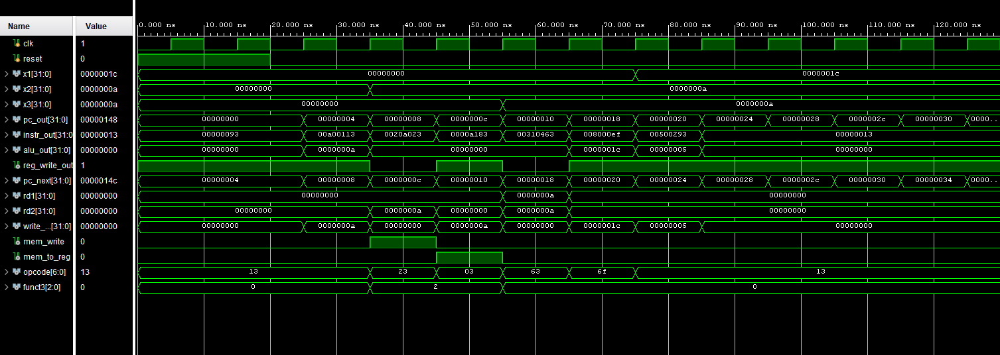

# RISC-V RV32I Single-Cycle CPU (Verilog)

This project is a complete single-cycle implementation of a RISC-V RV32I CPU core written from scratch in Verilog.  
The objective of this project is to understand how a real instruction set architecture maps to hardware datapath and control logic at the RTL level.

The design prioritizes correctness and architectural clarity over performance optimizations such as pipelining.

---

## Instruction Support (RV32I)

### Arithmetic and Logical (Register)
- ADD, SUB
- AND, OR, XOR
- SLL, SRL, SRA

### Arithmetic and Logical (Immediate)
- ADDI
- ANDI, ORI, XORI
- SLTI, SLTIU

### Memory Access
- LW (Load Word)
- SW (Store Word)

### Control Flow
- BEQ, BNE
- BLT, BGE (signed)
- BLTU, BGEU (unsigned)
- JAL (Jump and Link)
- JALR (Jump and Link Register)

### Upper Immediate Instructions
- LUI (Load Upper Immediate)
- AUIPC (Add Upper Immediate to PC)

All listed instructions follow the RV32I specification and execute in a single clock cycle.

---

## CPU Architecture

- Single-cycle datapath
- Separate instruction memory and data memory
- 32 × 32-bit register file
- ALU supporting arithmetic, logical, shift, and comparison operations
- Program Counter (PC) with support for sequential execution, branches, and jumps
- Write-back selection between ALU results and memory data
- Immediate decoding implemented for I, S, B, U, and J instruction formats

---

## Design Details

- Instruction decoding using opcode, funct3, and funct7 fields
- Control logic implemented using combinational always blocks
- PC updated synchronously with branch and jump resolution
- Signed and unsigned comparisons handled explicitly
- No pipelining; each instruction completes in one cycle

---

## Verification

The CPU is verified using a self-written Verilog testbench and waveform-based simulation in Xilinx Vivado.

Verification includes:
- Correct instruction fetch and decode
- Correct ALU operation and register write-back
- Functional load and store behavior
- Correct branch and jump control
- Validation of control signals such as reg_write, mem_write, and mem_to_reg

Key datapath and control signals are observed directly in simulation waveforms.

---

## Tools Used
- Verilog HDL
- Xilinx Vivado (simulation and waveform analysis)

---

## Project Status

This project represents a complete single-cycle RV32I CPU implementation and is considered feature-complete.

Further enhancements such as pipelining, hazard handling, or exception support are intentionally excluded and would be explored as separate projects.

## Verification Waveform

The following waveform demonstrates correct instruction execution, PC updates, ALU operation, and control signal behavior for the single-cycle RV32I CPU.

